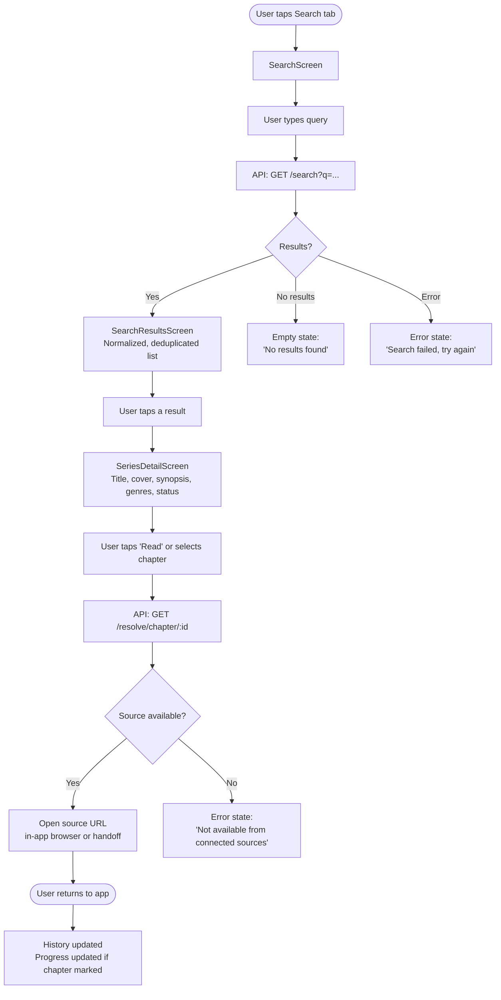
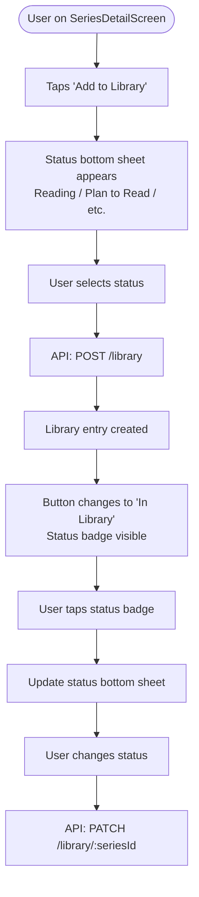
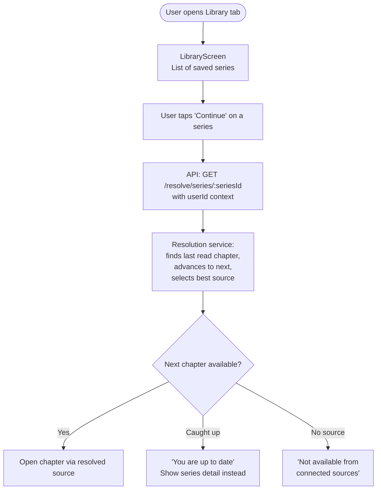
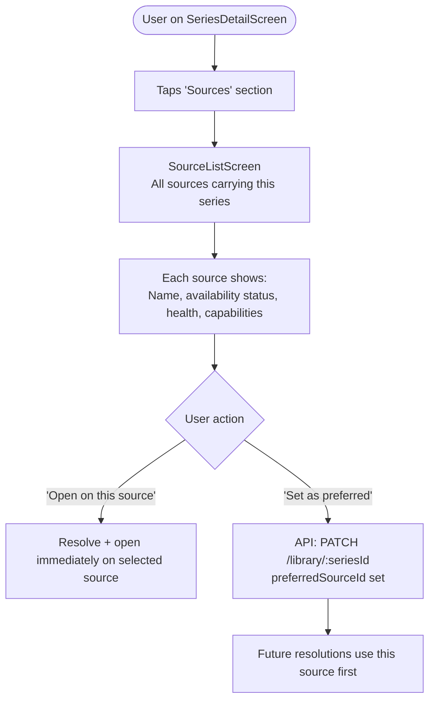
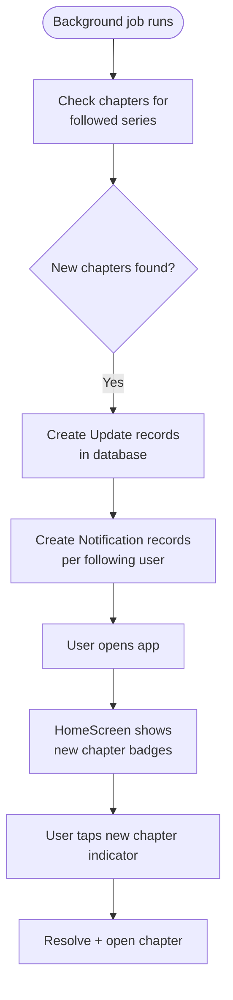
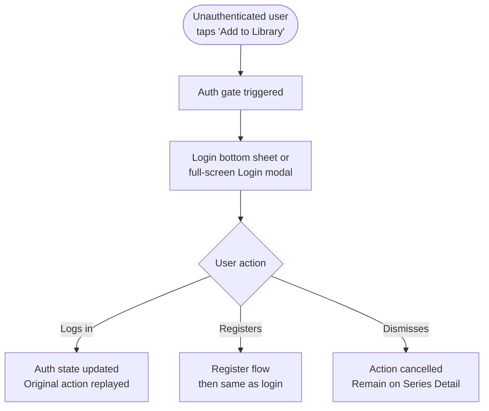
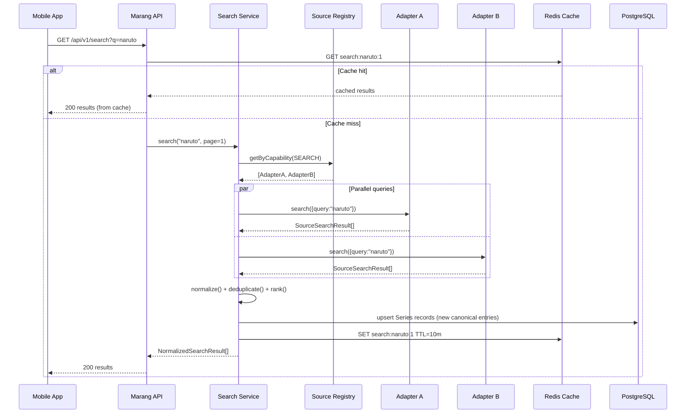
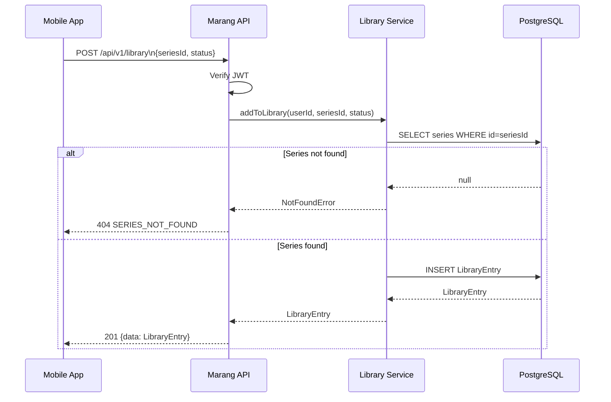
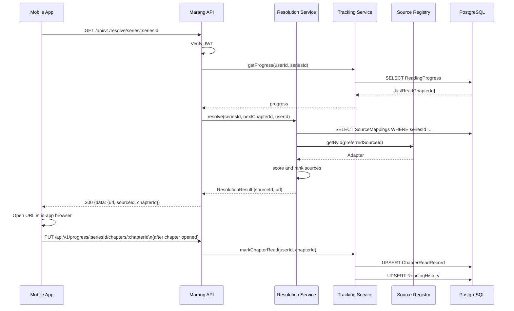
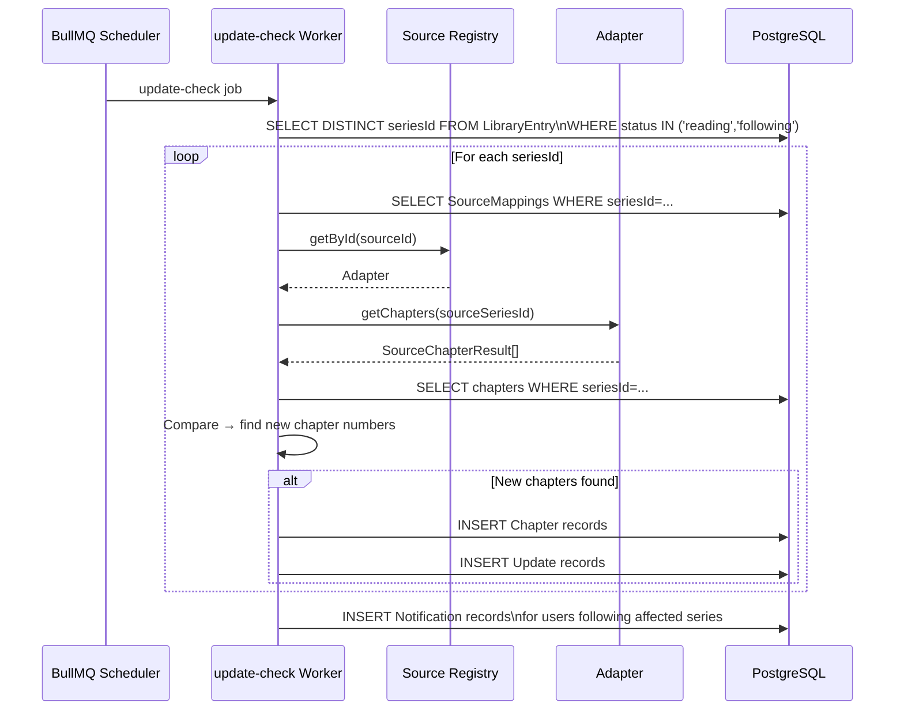

# Design.md — UX Architecture and System Design
# Marang Archive

**Version:** 0.1.0
**Status:** Draft
**Last Updated:** 2026-08-07

---

## Table of Contents

1. [UX Architecture](#1-ux-architecture)
2. [Information Architecture](#2-information-architecture)
3. [Navigation Structure](#3-navigation-structure)
4. [Screen Inventory](#4-screen-inventory)
5. [User Flow Diagrams](#5-user-flow-diagrams)
6. [Screen Specifications](#6-screen-specifications)
7. [Component Architecture](#7-component-architecture)
8. [System Design](#8-system-design)
9. [Data Flow Diagrams](#9-data-flow-diagrams)
10. [Error and Empty States](#10-error-and-empty-states)
11. [UX Principles](#11-ux-principles)

---

## 1. UX Architecture

Marang Archive is a **mobile-first** application. The primary interface is a React Native app optimized for one-handed use on phones, with fast access to the three most frequent actions a user performs:

1. **Continue reading** a series in progress.
2. **Search** for a new series.
3. **Check** what has updated in their library.

Everything else is secondary. The navigation and screen hierarchy must reflect this priority.

The app is a **gateway and organizer** — not a content host. The UX communicates this clearly: Marang shows where content is and helps the user get there, but the reading itself happens on the source. This distinction shapes several UX decisions:
- Series pages have an "Open" or "Read" call-to-action that resolves and hands off.
- There is no built-in reader UI in MVP.
- The app should always return cleanly after a user returns from a source.

---

## 2. Information Architecture

```
Marang Archive
│
├── Home
│   ├── Continue Reading (in-progress series, last read)
│   ├── Recent Updates (new chapters in library)
│   └── Recently Viewed
│
├── Search
│   ├── Search Input
│   ├── Search Results
│   │   └── Series Detail
│   │       ├── Chapter List
│   │       └── Available Sources
│   └── (Browse by genre — post-MVP)
│
├── Library
│   ├── All entries (filterable by status)
│   │   └── Series Detail (same screen as Search → Series Detail)
│   └── Search within library
│
├── Updates
│   └── New chapter feed for followed series
│
└── Profile / Settings
    ├── Account
    ├── Preferences (language, notifications)
    ├── Linked Sources (visible sources, health)
    └── App Settings (theme, etc.)
```

### Key IA Decisions

- Series Detail is a single shared screen, reachable from Search Results, Library, Updates, and Home. There is one canonical Series Detail screen.
- Chapter List is part of Series Detail (a tab or scrollable section), not a separate top-level screen.
- Available Sources is exposed within Series Detail — not a separate navigation destination.
- History is accessible from Profile/Settings in MVP (not a primary tab) — it is a secondary use case.

---

## 3. Navigation Structure

### Primary Navigation: Bottom Tab Bar

```
┌──────────────────────────────────────────┐
│                                          │
│             [Screen Content]             │
│                                          │
├──────────┬──────────┬──────────┬─────────┤
│   Home   │  Search  │ Library  │ Profile │
│   🏠     │   🔍     │   📚     │   👤    │
└──────────┴──────────┴──────────┴─────────┘
```

Four tabs. Five was considered but four is cleaner at MVP scale:
- **Home** — Continue reading, recent updates, recently viewed.
- **Search** — Unified search across sources.
- **Library** — Personal saved series.
- **Profile** — Account, settings, preferences, history.

Updates could be a fifth tab post-MVP when the updates feature is well-developed. For MVP, a section on Home is sufficient.

### Stack Navigation Per Tab

Each tab has its own navigation stack, which preserves scroll position and back-navigation context.

```
Home Tab Stack:
  HomeScreen → SeriesDetailScreen → SourceListScreen

Search Tab Stack:
  SearchScreen → SearchResultsScreen → SeriesDetailScreen → SourceListScreen

Library Tab Stack:
  LibraryScreen → SeriesDetailScreen → SourceListScreen

Profile Tab Stack:
  ProfileScreen → SettingsScreen → HistoryScreen → PreferencesScreen
```

### Modal Screens

- Add to Library / Update Status — presented as a bottom sheet modal.
- Source selection override — bottom sheet modal.
- Chapter mark-as-read bulk action — bottom sheet modal.
- Login / Register — full-screen modal stack presented over the tab bar.

---

## 4. Screen Inventory

| Screen | Tab | Stack Level | Auth Required |
|--------|-----|-------------|---------------|
| HomeScreen | Home | Root | Yes |
| SearchScreen | Search | Root | No |
| SearchResultsScreen | Search | L2 | No |
| SeriesDetailScreen | Search/Library/Home | L2–L3 | No (view); Yes (library actions) |
| ChapterListScreen | Series Detail | L3 (or tab within detail) | No |
| SourceListScreen | Series Detail | L3 | No |
| LibraryScreen | Library | Root | Yes |
| ProfileScreen | Profile | Root | Yes |
| HistoryScreen | Profile | L2 | Yes |
| SettingsScreen | Profile | L2 | Yes |
| PreferencesScreen | Profile | L3 | Yes |
| LoginScreen | Modal | — | No |
| RegisterScreen | Modal | — | No |


---

## 5. User Flow Diagrams

### Flow 1: Search → Discover → Open



### Flow 2: Search → Save → Track



### Flow 3: Library → Continue Reading



### Flow 4: Series → Sources



### Flow 5: Updates → New Chapter



### Flow 6: Authentication Gate




---

## 6. Screen Specifications

### 6.1 HomeScreen

**Purpose:** The user's personal dashboard. Surfaces the most relevant actions immediately.

**Sections:**
- **Continue Reading** — Horizontally scrollable row of in-progress series. Each card shows: cover, title, next chapter number, unread count. Single tap continues reading.
- **Recent Updates** — Vertically listed new chapters from followed series, sorted by discovered date. Shows: cover thumbnail, series title, chapter number and title, time since update.
- **Recently Viewed** — Last 5–10 series accessed, shown as small cards.

**Empty State (new user):** Welcome message with a prompt to search for a first series.

**Loading State:** Skeleton cards for each section during initial load.

**Authenticated only.** Unauthenticated users see a prompt to log in.

---

### 6.2 SearchScreen

**Purpose:** Entry point for discovery.

**Components:**
- Prominent search input, auto-focused on screen entry.
- Search history (recent queries) shown below input when empty.
- Clear button on input.

**Behavior:**
- Search triggers on submit (not on each keystroke — prevents excessive API calls).
- Minimum 2 characters before search is allowed.
- Loading state: spinner + "Searching across sources…"

---

### 6.3 SearchResultsScreen

**Purpose:** Presents deduplicated, normalized results from all sources.

**List Item (SeriesCard):**
- Cover image (left, fixed size)
- Primary title
- Content type badge (Manga / Manhwa / Novel / etc.)
- Status badge (Ongoing / Completed / etc.)
- Source count ("Found on 3 sources")
- Authors (if available)

**Header:**
- Query string displayed
- Result count
- Filter controls: type, status [PROPOSED — post-MVP if complexity not justified in MVP]

**States:**
- Loading: skeleton list
- Empty: "No results for '[query]'. Try different keywords."
- Partial results: subtle banner "Some sources did not respond."
- Error: "Search failed. Check your connection and try again."

---

### 6.4 SeriesDetailScreen

**Purpose:** The canonical view of a series. Hub for all series-related actions.

**Layout (top to bottom):**

```
┌────────────────────────────────────┐
│  [Cover Image — hero or side]      │
│  Title                             │
│  Content type • Status             │
│  Authors / Artists                 │
├────────────────────────────────────┤
│  [Add to Library] [Read / Continue]│
├────────────────────────────────────┤
│  Synopsis (collapsible)            │
├────────────────────────────────────┤
│  Genres  (scrollable chips)        │
├────────────────────────────────────┤
│  Sources Section                   │
│  [Source A ✓] [Source B ✓] [...]   │
├────────────────────────────────────┤
│  Chapters                          │
│  Chapter N   Title     Date  [✓/○] │
│  Chapter N-1 Title     Date  [✓/○] │
│  ...                               │
└────────────────────────────────────┘
```

**Actions:**
- "Add to Library" / "In Library [Status]" — toggles library membership and status.
- "Read" (not in library) / "Continue" (in library, has progress) / "Start" (in library, no progress).
- Chapter row tap — opens that chapter via source resolution.
- Chapter row check icon — mark as read / unread.
- Source chip tap — opens SourceListScreen or sets preferred source.

**Reading progress indicator:** Last read chapter highlighted. Chapters above it shown as read (dimmed or checked).

---

### 6.5 LibraryScreen

**Purpose:** Personal saved series, organized by reading status.

**Layout:**
- Tab bar or segment control: All / Reading / Plan to Read / On Hold / Completed / Dropped
- Grid or list of SeriesCards (user preference [PROPOSED])
- Each card: cover, title, status badge, unread count badge, "Continue" shortcut button
- Search/filter input at top

**Empty State:** Per-status empty messages. e.g., "Nothing in 'Reading' yet. Search for a series to get started."

---

### 6.6 ProfileScreen

**Purpose:** Account management and app configuration.

**Sections:**
- Account info (email, display name)
- Reading stats (series count, chapters read — lightweight, computed)
- Links: History, Preferences, Sources, About
- Logout button

---

### 6.7 HistoryScreen

**Purpose:** Chronological access log.

**List:** Series/chapter accessed, timestamp, source used. Tap to reopen. Clear history button.

---

### 6.8 Login / Register Screens

**Login:** Email, password, submit. Link to register. Link to forgot password.

**Register:** Email, password, confirm password, submit. Link to login.

**Design principle:** Simple, fast, no friction. No CAPTCHA, social login, or marketing copy in MVP.


---

## 7. Component Architecture

### 7.1 Shared Component Categories

```
components/
├── common/
│   ├── SeriesCard          — Used in Search Results, Library, Home
│   ├── ChapterRow          — Used in Series Detail chapter list
│   ├── SourceBadge         — Source name + health indicator chip
│   ├── StatusBadge         — Reading status color chip
│   ├── ContentTypeBadge    — Manga/Manhwa/Novel type chip
│   ├── CoverImage          — Cached cover with placeholder and error state
│   ├── LoadingSkeleton     — Reusable skeleton shapes
│   ├── EmptyState          — Icon + message + optional CTA
│   └── ErrorState          — Error icon + message + retry button
│
├── layout/
│   ├── ScreenContainer     — Safe area + scroll wrapper
│   ├── SectionHeader       — Titled section with optional "see all" link
│   └── Divider
│
├── sheets/
│   ├── LibraryStatusSheet  — Bottom sheet for add/update library status
│   ├── SourceSelectSheet   — Bottom sheet for source selection
│   └── ConfirmSheet        — Generic confirmation bottom sheet
│
└── auth/
    ├── AuthGate            — Wraps actions that require authentication
    └── TokenRefreshHandler — Silent token refresh on app foreground
```

### 7.2 SeriesCard Component

The most frequently rendered component. Used in three contexts: search results (full width), library grid (smaller), home row (horizontal scroll).

```
Props:
  series: SeriesSummary
  variant: 'full' | 'grid' | 'compact'
  onPress: () => void
  onContinuePress?: () => void    // shown only for in-library series
  unreadCount?: number
  readingStatus?: ReadingStatus
  showSourceCount?: boolean
```

Cover loads lazily. Placeholder shown while loading. Broken image falls back to a title-initial avatar.

### 7.3 AuthGate Component

Wraps any action that requires authentication. If the user is not authenticated, intercepts the action, presents the login modal, and replays the action after successful login.

```typescript
<AuthGate action="add-to-library" onAuthenticated={handleAddToLibrary}>
  <Button>Add to Library</Button>
</AuthGate>
```

### 7.4 Accessibility Requirements Per Component

- All interactive elements have `accessibilityLabel` and `accessibilityRole`.
- `SeriesCard` role: `button`, label: `"{Title}, {contentType}, {status}"`.
- `CoverImage` role: `image`, label: `"Cover for {Title}"`.
- Status badges: `accessibilityLabel` describes the status in plain language.
- Bottom sheets trap focus while open; restore focus on dismiss.
- Minimum touch target: 44×44pt (iOS) / 48×48dp (Android).


---

## 8. System Design

### 8.1 Component Responsibilities

| Component | Responsibility | Must Not |
|-----------|---------------|----------|
| React Native App | UI rendering, user interaction, local state, API calls via TanStack Query | Contain source-specific logic; call adapters directly |
| Marang API | HTTP routing, request validation, auth middleware, response formatting | Contain business logic; call adapters directly |
| Search Service | Orchestrate parallel source queries, normalize, deduplicate, rank | Know how any individual source works |
| Catalog Service | Create/read/update canonical Series records | Pull data from sources directly (goes through Search/Resolution) |
| Matching Service | Compare normalized results and determine canonical identity | Make source API calls |
| Library Service | Manage user library entries | Know which source a series comes from |
| Tracking Service | Record and retrieve reading progress and history | Resolve sources |
| Resolution Service | Select the best source for a request | Store user library data |
| Source Registry | Maintain registered adapters, delegate capability queries | Know what Marang does with results |
| Source Adapter | Call one external source, return Source Models | Know about canonical models, users, library |
| Normalizer (per adapter) | Map Source Model to Canonical Model | Know about users or other sources |
| BullMQ Workers | Execute background jobs (update checks, health checks) | Serve HTTP requests |

### 8.2 Module Dependency Rules

```
API module          → may call: auth, catalog, search, library, tracking, resolution
Search module       → may call: sources (registry), catalog, matching
Catalog module      → may call: (no source calls directly; receives normalized data)
Matching module     → may call: catalog (read only)
Library module      → may call: catalog (read), tracking (read summary)
Tracking module     → may call: catalog (read)
Resolution module   → may call: sources (registry), catalog
Sources module      → may call: adapters only
Workers module      → may call: sources (registry), catalog, notifications
Notifications module → may call: (data only; no source calls)

Strict prohibition:
Library module      → must NOT call: sources, resolution
Auth module         → must NOT call: sources, library, catalog
API module          → must NOT import: any adapter package
```


---

## 9. Data Flow Diagrams

### 9.1 Search Flow



### 9.2 Library Add Flow



### 9.3 Continue Reading Flow



### 9.4 Update Detection Flow




---

## 10. Error and Empty States

Every screen must have a defined response for each of these states. Incomplete states produce a confusing experience. This table defines the minimum required.

### 10.1 State Matrix

| Screen | Loading | Empty | Error | Partial |
|--------|---------|-------|-------|---------|
| HomeScreen | Skeleton cards per section | "Welcome" onboarding prompt | "Failed to load. Tap to retry." | Show available sections; hide failed sections |
| SearchScreen | — | Recent searches shown | — | — |
| SearchResultsScreen | Skeleton list | "No results for '[query]'." | "Search failed. Check connection." | Banner: "Some sources did not respond." |
| SeriesDetailScreen | Skeleton layout | — | "Failed to load series." with retry | Show cached data with staleness indicator |
| LibraryScreen | Skeleton list | Per-status message + CTA | "Failed to load library." with retry | — |
| HomeScreen (updates section) | Skeleton rows | "No new updates." | Silent fail; show last cached | — |
| HistoryScreen | Skeleton | "No history yet." | "Failed to load history." | — |

### 10.2 Error State Design Principles

- Every error state has a **retry** action.
- Error messages are written for the user — no raw error codes or stack traces.
- Errors distinguish between: network failure, server error, and "not found" — these need different copy.
- Source-specific failures are never surfaced to the user with source names in error messages (use "some sources" not "Source A failed").

### 10.3 Empty State Design Principles

- Empty states are not dead ends — include a contextual call to action.
  - Empty Library → "Search for a series to get started" with link to Search.
  - No search results → "Try different keywords or browse by genre [post-MVP]."
  - No reading history → "Start reading to see your history."
- Empty states use a simple illustration or icon, a short message, and a CTA button where applicable.

---

## 11. UX Principles

These are the governing UX decisions for Marang Archive. They resolve ambiguities consistently.

### P1 — Speed over completeness
A fast partial result is better than a slow complete result. Show what is available; communicate what is missing.

### P2 — User's library is sacred
Never silently modify library entries. Status changes, removal — always explicit. No "smart" auto-changes to reading status.

### P3 — Sources are transparent but not distracting
Users should be able to see where content comes from, but source names and logos should not dominate the UI. Marang's catalog is the identity; sources are a plumbing detail.

### P4 — Continuity matters
The "Continue Reading" action should work with one tap. Reducing friction between "open app" and "reading" is a primary performance metric.

### P5 — No dead ends
Every error state, empty state, and loading failure must provide a path forward.

### P6 — Accessibility is not optional
Screen reader compatibility, accessible touch targets, and sufficient contrast are requirements — not enhancements.

### P7 — Do not mislead on capability
If Marang cannot open a series (no available source), say so clearly. Do not present a broken experience.

### P8 — Return gracefully from sources
When a user returns from reading on an external source, the app state should be coherent. The series detail screen should still be in the stack; library and progress should reflect any updates.

### P9 — Offline honesty
If the device is offline, Marang should show cached data where available and clearly indicate the data may be stale. Never show an empty screen when cached data exists.

### P10 — Minimal permission requests
Request device permissions (notifications, etc.) only when the relevant feature is actively used — not on first launch.
