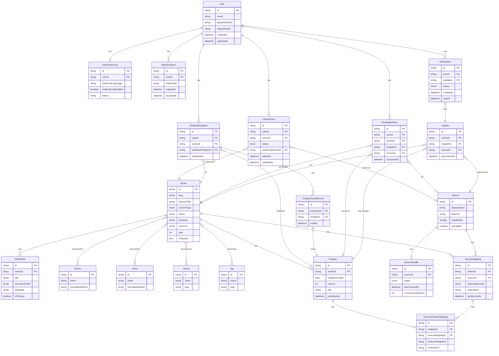

# Schema.md — Database Schema
# Marang Archive

**Version:** 0.1.0
**Status:** Draft
**Last Updated:** 2026-08-07

---

## Table of Contents

1. [Overview](#1-overview)
2. [Design Principles](#2-design-principles)
3. [Enumerations](#3-enumerations)
4. [Entity Definitions](#4-entity-definitions)
5. [Entity Relationship Diagram](#5-entity-relationship-diagram)
6. [Index Strategy](#6-index-strategy)
7. [Migration Strategy](#7-migration-strategy)
8. [Prisma Schema Reference](#8-prisma-schema-reference)

---

## 1. Overview

The database is **PostgreSQL**, accessed exclusively through **Prisma ORM**.

All schema changes are made through Prisma migrations. No ad-hoc DDL against the database. No direct column drops without a migration that handles existing data.

The schema is organized around two principal concerns:

- **Catalog** — The source-independent representation of all known series, chapters, authors, genres, and sources.
- **User Data** — User accounts, library entries, reading progress, history, and notifications.

These two domains are related but kept conceptually distinct. Catalog data is shared across all users. User data references catalog entities by ID.

---

## 2. Design Principles

- Library entries and reading progress reference **canonical Marang entity IDs** — never external source IDs.
- The `SourceMapping` table is the bridge between canonical entities and external source-specific IDs.
- JSONB is used for flexible, source-provided metadata that does not yet have a stable canonical shape.
- All primary keys are UUIDs (`cuid()` via Prisma — compact, URL-safe, ordered).
- Soft deletes are not used in MVP. Deleted records are hard-deleted. Reconsider post-MVP.
- Timestamps (`createdAt`, `updatedAt`) on every entity using `@updatedAt` where applicable.
- String fields: use `@db.VarChar(N)` where a maximum length is known; use `Text` for variable-length content (synopsis, etc.).

Status markers used throughout:
- `[CONFIRMED]` — Settled design decision
- `[PROPOSED]` — Reasonable but not finalized
- `[DECISION NEEDED]` — Requires explicit developer choice


---

## 3. Enumerations

### ContentType [CONFIRMED]
The type of serialized work.

```
manga        — Japanese comics, typically right-to-left
manhwa       — Korean comics, typically top-to-bottom (webtoon format or print)
manhua       — Chinese comics
webtoon      — Platform-native vertical scroll comics (may overlap with manhwa/manhua)
webNovel     — Text-based serialized fiction published online
lightNovel   — Japanese-origin prose novels, typically serialized
other        — Anything that doesn't fit cleanly
```

### SeriesStatus [CONFIRMED]
Publication status of a series.

```
ongoing      — Currently publishing
completed    — Fully published
hiatus       — Paused, expected to resume
cancelled    — Terminated, no continuation expected
unknown      — Status not determinable from available data
```

### ReadingStatus [CONFIRMED]
A user's personal reading status for a series in their library.

```
reading      — Actively reading
completed    — Finished all available content
onHold       — Paused intentionally
planToRead   — Saved for later
dropped      — Abandoned
```

### SourceHealthStatus [CONFIRMED]
Current operational health of a source adapter.

```
healthy      — Source responding normally
degraded     — Source responding but with elevated errors or latency
unhealthy    — Source not responding or consistently failing
unknown      — Not yet checked
```

### SourceCapability [CONFIRMED]
Capabilities a source adapter may or may not support.

```
SEARCH           — Can search for series by query string
METADATA         — Can return series metadata
SERIES           — Can return a series record
CHAPTERS         — Can return a chapter list
CHAPTER_CONTENT  — Can provide access to chapter content (URL or direct)
COVER            — Can provide cover image URL
UPDATES          — Can be polled for new chapters
```

### NotificationStatus [PROPOSED]

```
unread
read
dismissed
```


---

## 4. Entity Definitions

---

### 4.1 User [CONFIRMED]

**Purpose:** A registered Marang user. Root of all user-specific data.

| Field | Type | Constraints | Notes |
|-------|------|-------------|-------|
| id | String (cuid) | PK | |
| email | String | Unique, Not Null | Normalized to lowercase on write |
| passwordHash | String | Not Null | argon2id hash; never returned in API responses |
| displayName | String? | Nullable | Optional; defaults to null |
| createdAt | DateTime | Not Null, Default now() | |
| updatedAt | DateTime | Not Null, @updatedAt | |

**Relationships:**
- Has one `UserPreference`
- Has many `LibraryEntry`
- Has many `ReadingProgress`
- Has many `ReadingHistory`
- Has many `Notification`
- Has many `RefreshToken`

**Constraints:**
- `email` must be a valid email format (enforced at application layer via Zod, not DB constraint)
- `passwordHash` is never selected in query results by default — explicitly excluded in all public-facing queries

**Indexes:**
- `email` — unique index (implicit from `@unique`)

---

### 4.2 UserPreference [CONFIRMED]

**Purpose:** User-level settings and preferences. One per user.

| Field | Type | Constraints | Notes |
|-------|------|-------------|-------|
| id | String (cuid) | PK | |
| userId | String | Unique FK → User | One-to-one |
| preferredLanguage | String | Default "en" | BCP 47 language tag |
| notificationsEnabled | Boolean | Default true | |
| theme | String | Default "system" | "light" / "dark" / "system" [PROPOSED] |
| createdAt | DateTime | Not Null | |
| updatedAt | DateTime | Not Null, @updatedAt | |

**Relationships:** Belongs to `User`.

---

### 4.3 RefreshToken [CONFIRMED]

**Purpose:** Stores hashed refresh tokens for JWT refresh flow. Allows server-side invalidation (logout, security revocation).

| Field | Type | Constraints | Notes |
|-------|------|-------------|-------|
| id | String (cuid) | PK | |
| userId | String | FK → User | |
| tokenHash | String | Not Null | SHA-256 hash of the raw token |
| expiresAt | DateTime | Not Null | |
| createdAt | DateTime | Not Null | |
| revokedAt | DateTime? | Nullable | Set on logout/revocation |

**Relationships:** Belongs to `User`.

**Constraints:**
- Expired and revoked tokens should be periodically purged by a cleanup job.
- Raw token is never stored.

**Indexes:**
- `(userId, revokedAt, expiresAt)` — for efficient lookup of valid tokens per user


---

### 4.4 Series [CONFIRMED]

**Purpose:** The canonical, source-independent representation of a serialized work. This is the central entity of the entire catalog.

| Field | Type | Constraints | Notes |
|-------|------|-------------|-------|
| id | String (cuid) | PK | Marang-internal ID |
| slug | String | Unique, Not Null | URL-friendly identifier, e.g. "one-piece" |
| primaryTitle | String | Not Null | Best available canonical title |
| contentType | ContentType (enum) | Not Null | |
| status | SeriesStatus (enum) | Not Null, Default "unknown" | |
| synopsis | String? | Nullable | Plain text, may be long |
| coverUrl | String? | Nullable | External CDN URL |
| year | Int? | Nullable | Publication start year |
| metadata | Json | Default {} | JSONB — flexible source-provided extras |
| createdAt | DateTime | Not Null | |
| updatedAt | DateTime | Not Null, @updatedAt | |

**Relationships:**
- Has many `SeriesTitle`
- Has many `Chapter`
- Has many `SourceMapping`
- Has many `LibraryEntry` (via user)
- Has many `ReadingProgress` (via user)
- Has many `ReadingHistory` (via user)
- Has many `Update`
- Many-to-many `Author` (via `SeriesAuthor`)
- Many-to-many `Artist` (via `SeriesArtist`)
- Many-to-many `Genre` (via `SeriesGenre`)
- Many-to-many `Tag` (via `SeriesTag`)

**Constraints:**
- `slug` is generated at creation time from `primaryTitle`; must be unique; conflicts resolved by appending a short suffix.
- `coverUrl` is the best available cover at the time of last refresh. Not guaranteed to remain valid.
- `metadata` stores source-provided fields that do not yet have a canonical column.

**Indexes:**
- `slug` — unique
- `contentType`
- `status`
- `(contentType, status)` — compound, for browse/filter queries

---

### 4.5 SeriesTitle [CONFIRMED]

**Purpose:** All known titles for a series — primary, alternative, romanized, native script, etc. Enables reliable cross-source matching.

| Field | Type | Constraints | Notes |
|-------|------|-------------|-------|
| id | String (cuid) | PK | |
| seriesId | String | FK → Series | |
| title | String | Not Null | |
| normalizedTitle | String | Not Null | Lowercase, no punctuation, normalized Unicode |
| language | String? | Nullable | BCP 47, e.g. "en", "ja", "ko" |
| isPrimary | Boolean | Default false | Only one primary per series |
| createdAt | DateTime | Not Null | |

**Relationships:** Belongs to `Series`.

**Indexes:**
- `(seriesId)` — for fetching all titles of a series
- `normalizedTitle` — for matching queries
- `(normalizedTitle, language)` — compound, for language-aware matching

---

### 4.6 Author [CONFIRMED]

**Purpose:** A person credited as author of one or more series.

| Field | Type | Constraints | Notes |
|-------|------|-------------|-------|
| id | String (cuid) | PK | |
| name | String | Not Null | |
| normalizedName | String | Not Null | For matching |
| createdAt | DateTime | Not Null | |

**Relationships:** Many-to-many `Series` via `SeriesAuthor`.

**Indexes:**
- `normalizedName` — for matching

---

### 4.7 Artist [PROPOSED]

Same structure as `Author`. Separate table because the author/artist distinction matters for manga (story vs. art credits). Some series have the same person in both roles — that is represented by entries in both join tables.

[DECISION NEEDED] Whether to merge Author and Artist into a single `Person` table with a role enum, or keep them separate. Separate is simpler at MVP scale.

---

### 4.8 Genre [CONFIRMED]

**Purpose:** A canonical genre label (e.g., "Action", "Romance", "Isekai").

| Field | Type | Constraints | Notes |
|-------|------|-------------|-------|
| id | String (cuid) | PK | |
| name | String | Unique, Not Null | Normalized canonical name |
| slug | String | Unique, Not Null | URL-friendly |

**Relationships:** Many-to-many `Series` via `SeriesGenre`.

**Notes:** Genres are normalized at the Marang level. Source-specific genre labels are mapped to canonical genre names during normalization. Unknown source genres that have no canonical mapping are stored in `Tag` instead.

---

### 4.9 Tag [PROPOSED]

**Purpose:** Flexible labels for themes or descriptors that are too specific or inconsistent across sources to qualify as canonical genres.

Same structure as `Genre`. Distinct table to separate curated genres from free-form tags.


---

### 4.10 Chapter [CONFIRMED]

**Purpose:** A canonical chapter record belonging to a series. Chapters are normalized across sources — one Chapter record per chapter in Marang's catalog, regardless of how many sources carry it.

| Field | Type | Constraints | Notes |
|-------|------|-------------|-------|
| id | String (cuid) | PK | |
| seriesId | String | FK → Series | |
| chapterNumber | Float | Not Null | Float to handle chapter 12.5, special chapters |
| volume | Int? | Nullable | Volume number if known |
| title | String? | Nullable | Chapter title if provided |
| publishedAt | DateTime? | Nullable | Original publication date if known |
| createdAt | DateTime | Not Null | When Marang first discovered this chapter |
| updatedAt | DateTime | Not Null, @updatedAt | |

**Relationships:**
- Belongs to `Series`
- Has many `SourceChapterMapping` — maps to source-specific chapter IDs
- Referenced by `ReadingProgress` (lastReadChapterId)
- Referenced by `ChapterReadRecord`
- Referenced by `ReadingHistory`
- Referenced by `Update`

**Constraints:**
- `(seriesId, chapterNumber)` is unique — no duplicate chapter numbers per series.

**Indexes:**
- `(seriesId, chapterNumber)` — unique, compound; primary query pattern
- `(seriesId, publishedAt)` — for ordered chapter lists

---

### 4.11 Source [CONFIRMED]

**Purpose:** Represents a registered external source (not an adapter instance, but the persistent record of a source).

| Field | Type | Constraints | Notes |
|-------|------|-------------|-------|
| id | String | PK | Matches adapter `id`, e.g. "source-a" |
| displayName | String | Not Null | Human-readable name |
| baseUrl | String? | Nullable | Primary URL for display |
| capabilities | String[] | Not Null | Array of SourceCapability enum values |
| isEnabled | Boolean | Default true | Can be disabled without removing |
| createdAt | DateTime | Not Null | |
| updatedAt | DateTime | Not Null, @updatedAt | |

**Relationships:**
- Has many `SourceMapping`
- Has one `SourceHealth`

**Notes:** This is a database record that mirrors the registered adapter. It allows querying source information without instantiating the adapter.

---

### 4.12 SourceHealth [CONFIRMED]

**Purpose:** Current and historical health state of a source.

| Field | Type | Constraints | Notes |
|-------|------|-------------|-------|
| id | String (cuid) | PK | |
| sourceId | String | Unique FK → Source | One per source |
| status | SourceHealthStatus (enum) | Not Null, Default "unknown" | |
| lastCheckedAt | DateTime? | Nullable | |
| lastSuccessAt | DateTime? | Nullable | |
| lastErrorAt | DateTime? | Nullable | |
| lastErrorMessage | String? | Nullable | Most recent error for debugging |
| consecutiveFailures | Int | Default 0 | |
| updatedAt | DateTime | Not Null, @updatedAt | |

**Relationships:** Belongs to `Source`.

---

### 4.13 SourceMapping [CONFIRMED]

**Purpose:** The bridge between a canonical Marang `Series` and the source-specific ID used by an external source.

| Field | Type | Constraints | Notes |
|-------|------|-------------|-------|
| id | String (cuid) | PK | |
| seriesId | String | FK → Series | Canonical series |
| sourceId | String | FK → Source | Which source |
| externalSeriesId | String | Not Null | The ID used by the source |
| externalUrl | String? | Nullable | Direct URL to series on source |
| lastSyncedAt | DateTime? | Nullable | When metadata was last refreshed |
| createdAt | DateTime | Not Null | |

**Relationships:**
- Belongs to `Series`
- Belongs to `Source`
- Has many `SourceChapterMapping`

**Constraints:**
- `(sourceId, externalSeriesId)` is unique — one canonical mapping per source series ID.

**Indexes:**
- `(seriesId, sourceId)` — for looking up a series on a specific source
- `(sourceId, externalSeriesId)` — unique, for reverse lookup when ingesting source data

---

### 4.14 SourceChapterMapping [CONFIRMED]

**Purpose:** Maps a canonical `Chapter` to a source-specific chapter ID. Needed because sources use their own IDs for chapters.

| Field | Type | Constraints | Notes |
|-------|------|-------------|-------|
| id | String (cuid) | PK | |
| chapterId | String | FK → Chapter | Canonical chapter |
| sourceMappingId | String | FK → SourceMapping | Which source+series |
| externalChapterId | String | Not Null | Source's own chapter identifier |
| externalUrl | String? | Nullable | Direct URL to chapter on source |
| createdAt | DateTime | Not Null | |

**Constraints:**
- `(sourceMappingId, externalChapterId)` is unique.

**Indexes:**
- `(chapterId, sourceMappingId)` — for resolution queries


---

### 4.15 LibraryEntry [CONFIRMED]

**Purpose:** A user's saved series. The core of their personal library. References the canonical series — never a source-specific ID.

| Field | Type | Constraints | Notes |
|-------|------|-------------|-------|
| id | String (cuid) | PK | |
| userId | String | FK → User | |
| seriesId | String | FK → Series | Canonical series ID |
| status | ReadingStatus (enum) | Not Null, Default "planToRead" | |
| preferredSourceId | String? | Nullable FK → Source | User's preferred source for this series |
| addedAt | DateTime | Not Null, Default now() | |
| updatedAt | DateTime | Not Null, @updatedAt | |

**Relationships:**
- Belongs to `User`
- Belongs to `Series`
- Optionally references `Source` (preferred source)

**Constraints:**
- `(userId, seriesId)` is unique — a user can only have one library entry per series.

**Indexes:**
- `(userId, status)` — for filtering library by status
- `(userId, updatedAt DESC)` — for default sort (most recently updated first)
- `(userId, seriesId)` — unique, for existence checks

---

### 4.16 ReadingProgress [CONFIRMED]

**Purpose:** Tracks a user's reading progress per series. Stores the last read chapter and the set of all read chapters.

| Field | Type | Constraints | Notes |
|-------|------|-------------|-------|
| id | String (cuid) | PK | |
| userId | String | FK → User | |
| seriesId | String | FK → Series | |
| lastReadChapterId | String? | Nullable FK → Chapter | Most recently read chapter |
| lastReadAt | DateTime? | Nullable | When the last chapter was read |
| createdAt | DateTime | Not Null | |
| updatedAt | DateTime | Not Null, @updatedAt | |

**Relationships:**
- Belongs to `User`
- Belongs to `Series`
- Has many `ChapterReadRecord`

**Constraints:**
- `(userId, seriesId)` is unique.

**Indexes:**
- `(userId, seriesId)` — unique, primary query pattern
- `(userId, lastReadAt DESC)` — for "recently reading" queries

---

### 4.17 ChapterReadRecord [CONFIRMED]

**Purpose:** Records that a user has read a specific chapter. The presence of a record means "read"; absence means "not read."

| Field | Type | Constraints | Notes |
|-------|------|-------------|-------|
| id | String (cuid) | PK | |
| progressId | String | FK → ReadingProgress | |
| chapterId | String | FK → Chapter | |
| readAt | DateTime | Not Null, Default now() | |

**Constraints:**
- `(progressId, chapterId)` is unique — a chapter is either read or not; no duplicates.

**Indexes:**
- `(progressId, chapterId)` — unique, for checking read state
- `(progressId)` — for bulk "count read chapters" queries

**Notes:** This design allows efficient "unread count" calculation: `totalChapters - readChapters`. For series with thousands of chapters, this query should use a count aggregate, not a full row scan.

---

### 4.18 ReadingHistory [CONFIRMED]

**Purpose:** A chronological log of series and chapters the user has accessed through Marang. Independent of library membership.

| Field | Type | Constraints | Notes |
|-------|------|-------------|-------|
| id | String (cuid) | PK | |
| userId | String | FK → User | |
| seriesId | String | FK → Series | |
| chapterId | String? | Nullable FK → Chapter | If a specific chapter was accessed |
| sourceId | String? | Nullable FK → Source | Which source was used |
| accessedAt | DateTime | Not Null, Default now() | |

**Relationships:**
- Belongs to `User`
- Belongs to `Series`
- Optionally belongs to `Chapter`
- Optionally references `Source`

**Constraints:** No uniqueness constraint — each access creates a new record.

**Lifecycle:** Capped at 100 entries per user (enforced at application layer). Oldest entries deleted when cap is exceeded.

**Indexes:**
- `(userId, accessedAt DESC)` — primary query pattern for history list


---

### 4.19 Update [CONFIRMED]

**Purpose:** Records that new chapters have been detected for a series. Used to populate the Updates feed.

| Field | Type | Constraints | Notes |
|-------|------|-------------|-------|
| id | String (cuid) | PK | |
| seriesId | String | FK → Series | |
| chapterId | String | FK → Chapter | The new chapter |
| sourceId | String | FK → Source | Which source it was detected on |
| discoveredAt | DateTime | Not Null, Default now() | When the update job found it |

**Relationships:**
- Belongs to `Series`
- Belongs to `Chapter`
- Belongs to `Source`

**Constraints:**
- `(seriesId, chapterId)` is unique — each new chapter generates at most one Update record.

**Indexes:**
- `(seriesId, discoveredAt DESC)` — for updates feed per series
- `discoveredAt DESC` — for global updates feed

---

### 4.20 Notification [PROPOSED]

**Purpose:** Per-user notification records generated from `Update` events.

| Field | Type | Constraints | Notes |
|-------|------|-------------|-------|
| id | String (cuid) | PK | |
| userId | String | FK → User | |
| updateId | String | FK → Update | The underlying update event |
| status | NotificationStatus (enum) | Default "unread" | |
| createdAt | DateTime | Not Null | |
| readAt | DateTime? | Nullable | |

**Relationships:**
- Belongs to `User`
- Belongs to `Update`

**Indexes:**
- `(userId, status, createdAt DESC)` — for unread notification queries
- `(userId, createdAt DESC)` — for full notification history

---

### 4.21 Join Tables (Many-to-Many)

These are simple association tables with no additional fields beyond the foreign keys.

#### SeriesAuthor
```
seriesId  FK → Series
authorId  FK → Author
PK: (seriesId, authorId)
```

#### SeriesArtist [PROPOSED]
```
seriesId  FK → Series
artistId  FK → Artist
PK: (seriesId, artistId)
```

#### SeriesGenre
```
seriesId  FK → Series
genreId   FK → Genre
PK: (seriesId, genreId)
```

#### SeriesTag [PROPOSED]
```
seriesId  FK → Series
tagId     FK → Tag
PK: (seriesId, tagId)
```


---

## 5. Entity Relationship Diagram




---

## 6. Index Strategy

### Critical Indexes

| Table | Index | Type | Reason |
|-------|-------|------|--------|
| User | `email` | Unique | Login lookup |
| Series | `slug` | Unique | URL routing |
| Series | `(contentType, status)` | Compound | Browse/filter queries |
| SeriesTitle | `normalizedTitle` | Index | Matching and dedup |
| SeriesTitle | `(normalizedTitle, language)` | Compound | Language-aware matching |
| Chapter | `(seriesId, chapterNumber)` | Unique compound | Chapter list + progress |
| SourceMapping | `(sourceId, externalSeriesId)` | Unique compound | Ingest dedup |
| SourceMapping | `(seriesId, sourceId)` | Compound | Resolution queries |
| SourceChapterMapping | `(sourceMappingId, externalChapterId)` | Unique compound | Chapter resolution |
| LibraryEntry | `(userId, seriesId)` | Unique compound | Existence check |
| LibraryEntry | `(userId, status)` | Compound | Status filter |
| LibraryEntry | `(userId, updatedAt DESC)` | Compound | Default sort |
| ReadingProgress | `(userId, seriesId)` | Unique compound | Progress fetch |
| ChapterReadRecord | `(progressId, chapterId)` | Unique compound | Read state check |
| ReadingHistory | `(userId, accessedAt DESC)` | Compound | History list |
| Update | `(seriesId, chapterId)` | Unique compound | Dedup on insert |
| Notification | `(userId, status, createdAt DESC)` | Compound | Unread count + list |
| RefreshToken | `(userId, revokedAt, expiresAt)` | Compound | Valid token lookup |

### Notes on Index Maintenance

- Add indexes via Prisma migrations only — not manually.
- Review query patterns after MVP is running and add indexes based on observed slow queries.
- JSONB columns (`Series.metadata`) do not have GIN indexes in MVP. Add only if specific JSONB queries become common.

---

## 7. Migration Strategy

### Rules [CONFIRMED]

1. **All schema changes via Prisma migrations.** No manual DDL, ever.
2. **Never drop a column without a migration that handles existing data.**
3. **Additive changes are safe** (new nullable columns, new tables). Deploy without concern.
4. **Breaking changes** (rename column, change type, drop column) require:
   - A migration that creates the new structure.
   - A data migration step.
   - A cleanup migration to remove the old structure once clients are updated.
5. **Migration files are committed** and version-controlled alongside code.
6. **`prisma migrate dev`** for local development (generates and applies migration).
7. **`prisma migrate deploy`** for production (applies pending migrations only; does not generate).

### Migration Naming Convention

```
YYYYMMDD_HHMMSS_description_of_change
Examples:
  20260807_120000_create_initial_schema
  20260810_093000_add_reading_history
  20260815_154500_add_notification_status
```

Prisma generates the timestamp automatically; add a clear description suffix.

---

## 8. Prisma Schema Reference

Below is the complete Prisma schema corresponding to the entities above. This is the **authoritative schema definition** — the entities in section 4 describe intent; this is the implementation.

> **[PROPOSED]** This schema is the initial design. It will evolve as implementation begins. The migration history in `backend/prisma/migrations/` is the ground truth once development starts.

```prisma
// backend/prisma/schema.prisma

generator client {
  provider = "prisma-client-js"
}

datasource db {
  provider = "postgresql"
  url      = env("DATABASE_URL")
}

// ─── Enumerations ────────────────────────────────────────────────────────────

enum ContentType {
  manga
  manhwa
  manhua
  webtoon
  webNovel
  lightNovel
  other
}

enum SeriesStatus {
  ongoing
  completed
  hiatus
  cancelled
  unknown
}

enum ReadingStatus {
  reading
  completed
  onHold
  planToRead
  dropped
}

enum SourceHealthStatus {
  healthy
  degraded
  unhealthy
  unknown
}

enum NotificationStatus {
  unread
  read
  dismissed
}

// ─── User Domain ─────────────────────────────────────────────────────────────

model User {
  id           String    @id @default(cuid())
  email        String    @unique
  passwordHash String
  displayName  String?
  createdAt    DateTime  @default(now())
  updatedAt    DateTime  @updatedAt

  preference     UserPreference?
  refreshTokens  RefreshToken[]
  libraryEntries LibraryEntry[]
  progress       ReadingProgress[]
  history        ReadingHistory[]
  notifications  Notification[]
}

model UserPreference {
  id                   String   @id @default(cuid())
  userId               String   @unique
  preferredLanguage    String   @default("en")
  notificationsEnabled Boolean  @default(true)
  theme                String   @default("system")
  createdAt            DateTime @default(now())
  updatedAt            DateTime @updatedAt

  user User @relation(fields: [userId], references: [id], onDelete: Cascade)
}

model RefreshToken {
  id        String    @id @default(cuid())
  userId    String
  tokenHash String
  expiresAt DateTime
  createdAt DateTime  @default(now())
  revokedAt DateTime?

  user User @relation(fields: [userId], references: [id], onDelete: Cascade)

  @@index([userId, revokedAt, expiresAt])
}

// ─── Catalog Domain ──────────────────────────────────────────────────────────

model Series {
  id           String       @id @default(cuid())
  slug         String       @unique
  primaryTitle String
  contentType  ContentType
  status       SeriesStatus @default(unknown)
  synopsis     String?
  coverUrl     String?
  year         Int?
  metadata     Json         @default("{}")
  createdAt    DateTime     @default(now())
  updatedAt    DateTime     @updatedAt

  titles         SeriesTitle[]
  chapters       Chapter[]
  sourceMappings SourceMapping[]
  authors        SeriesAuthor[]
  artists        SeriesArtist[]
  genres         SeriesGenre[]
  tags           SeriesTag[]
  libraryEntries LibraryEntry[]
  progress       ReadingProgress[]
  history        ReadingHistory[]
  updates        Update[]

  @@index([contentType, status])
}

model SeriesTitle {
  id              String   @id @default(cuid())
  seriesId        String
  title           String
  normalizedTitle String
  language        String?
  isPrimary       Boolean  @default(false)
  createdAt       DateTime @default(now())

  series Series @relation(fields: [seriesId], references: [id], onDelete: Cascade)

  @@index([seriesId])
  @@index([normalizedTitle])
  @@index([normalizedTitle, language])
}

model Author {
  id             String         @id @default(cuid())
  name           String
  normalizedName String
  createdAt      DateTime       @default(now())
  series         SeriesAuthor[]

  @@index([normalizedName])
}

model Artist {
  id             String         @id @default(cuid())
  name           String
  normalizedName String
  createdAt      DateTime       @default(now())
  series         SeriesArtist[]

  @@index([normalizedName])
}

model Genre {
  id     String        @id @default(cuid())
  name   String        @unique
  slug   String        @unique
  series SeriesGenre[]
}

model Tag {
  id     String      @id @default(cuid())
  name   String      @unique
  slug   String      @unique
  series SeriesTag[]
}

model Chapter {
  id            String    @id @default(cuid())
  seriesId      String
  chapterNumber Float
  volume        Int?
  title         String?
  publishedAt   DateTime?
  createdAt     DateTime  @default(now())
  updatedAt     DateTime  @updatedAt

  series         Series                 @relation(fields: [seriesId], references: [id], onDelete: Cascade)
  sourceMappings SourceChapterMapping[]
  readRecords    ChapterReadRecord[]
  history        ReadingHistory[]
  updates        Update[]
  progressRefs   ReadingProgress[]      @relation("lastReadChapter")

  @@unique([seriesId, chapterNumber])
  @@index([seriesId, publishedAt])
}

// ─── Join Tables (Catalog) ────────────────────────────────────────────────────

model SeriesAuthor {
  seriesId String
  authorId String

  series Series @relation(fields: [seriesId], references: [id], onDelete: Cascade)
  author Author @relation(fields: [authorId], references: [id], onDelete: Cascade)

  @@id([seriesId, authorId])
}

model SeriesArtist {
  seriesId String
  artistId String

  series Series @relation(fields: [seriesId], references: [id], onDelete: Cascade)
  artist Artist @relation(fields: [artistId], references: [id], onDelete: Cascade)

  @@id([seriesId, artistId])
}

model SeriesGenre {
  seriesId String
  genreId  String

  series Series @relation(fields: [seriesId], references: [id], onDelete: Cascade)
  genre  Genre  @relation(fields: [genreId], references: [id], onDelete: Cascade)

  @@id([seriesId, genreId])
}

model SeriesTag {
  seriesId String
  tagId    String

  series Series @relation(fields: [seriesId], references: [id], onDelete: Cascade)
  tag    Tag    @relation(fields: [tagId], references: [id], onDelete: Cascade)

  @@id([seriesId, tagId])
}

// ─── Source Domain ────────────────────────────────────────────────────────────

model Source {
  id           String   @id
  displayName  String
  baseUrl      String?
  capabilities String[]
  isEnabled    Boolean  @default(true)
  createdAt    DateTime @default(now())
  updatedAt    DateTime @updatedAt

  health         SourceHealth?
  sourceMappings SourceMapping[]
  libraryEntries LibraryEntry[]
  history        ReadingHistory[]
  updates        Update[]
}

model SourceHealth {
  id                  String             @id @default(cuid())
  sourceId            String             @unique
  status              SourceHealthStatus @default(unknown)
  lastCheckedAt       DateTime?
  lastSuccessAt       DateTime?
  lastErrorAt         DateTime?
  lastErrorMessage    String?
  consecutiveFailures Int                @default(0)
  updatedAt           DateTime           @updatedAt

  source Source @relation(fields: [sourceId], references: [id], onDelete: Cascade)
}

model SourceMapping {
  id               String    @id @default(cuid())
  seriesId         String
  sourceId         String
  externalSeriesId String
  externalUrl      String?
  lastSyncedAt     DateTime?
  createdAt        DateTime  @default(now())

  series          Series                 @relation(fields: [seriesId], references: [id], onDelete: Cascade)
  source          Source                 @relation(fields: [sourceId], references: [id], onDelete: Cascade)
  chapterMappings SourceChapterMapping[]

  @@unique([sourceId, externalSeriesId])
  @@index([seriesId, sourceId])
}

model SourceChapterMapping {
  id                String   @id @default(cuid())
  chapterId         String
  sourceMappingId   String
  externalChapterId String
  externalUrl       String?
  createdAt         DateTime @default(now())

  chapter       Chapter       @relation(fields: [chapterId], references: [id], onDelete: Cascade)
  sourceMapping SourceMapping @relation(fields: [sourceMappingId], references: [id], onDelete: Cascade)

  @@unique([sourceMappingId, externalChapterId])
  @@index([chapterId, sourceMappingId])
}

// ─── User-Library Domain ─────────────────────────────────────────────────────

model LibraryEntry {
  id                String        @id @default(cuid())
  userId            String
  seriesId          String
  status            ReadingStatus @default(planToRead)
  preferredSourceId String?
  addedAt           DateTime      @default(now())
  updatedAt         DateTime      @updatedAt

  user            User    @relation(fields: [userId], references: [id], onDelete: Cascade)
  series          Series  @relation(fields: [seriesId], references: [id], onDelete: Cascade)
  preferredSource Source? @relation(fields: [preferredSourceId], references: [id])

  @@unique([userId, seriesId])
  @@index([userId, status])
  @@index([userId, updatedAt(sort: Desc)])
}

model ReadingProgress {
  id                 String    @id @default(cuid())
  userId             String
  seriesId           String
  lastReadChapterId  String?
  lastReadAt         DateTime?
  createdAt          DateTime  @default(now())
  updatedAt          DateTime  @updatedAt

  user            User                @relation(fields: [userId], references: [id], onDelete: Cascade)
  series          Series              @relation(fields: [seriesId], references: [id], onDelete: Cascade)
  lastReadChapter Chapter?            @relation("lastReadChapter", fields: [lastReadChapterId], references: [id])
  chapterRecords  ChapterReadRecord[]

  @@unique([userId, seriesId])
  @@index([userId, lastReadAt(sort: Desc)])
}

model ChapterReadRecord {
  id         String   @id @default(cuid())
  progressId String
  chapterId  String
  readAt     DateTime @default(now())

  progress ReadingProgress @relation(fields: [progressId], references: [id], onDelete: Cascade)
  chapter  Chapter         @relation(fields: [chapterId], references: [id], onDelete: Cascade)

  @@unique([progressId, chapterId])
  @@index([progressId])
}

model ReadingHistory {
  id         String   @id @default(cuid())
  userId     String
  seriesId   String
  chapterId  String?
  sourceId   String?
  accessedAt DateTime @default(now())

  user    User     @relation(fields: [userId], references: [id], onDelete: Cascade)
  series  Series   @relation(fields: [seriesId], references: [id], onDelete: Cascade)
  chapter Chapter? @relation(fields: [chapterId], references: [id])
  source  Source?  @relation(fields: [sourceId], references: [id])

  @@index([userId, accessedAt(sort: Desc)])
}

// ─── Updates and Notifications ───────────────────────────────────────────────

model Update {
  id           String   @id @default(cuid())
  seriesId     String
  chapterId    String
  sourceId     String
  discoveredAt DateTime @default(now())

  series        Series         @relation(fields: [seriesId], references: [id], onDelete: Cascade)
  chapter       Chapter        @relation(fields: [chapterId], references: [id], onDelete: Cascade)
  source        Source         @relation(fields: [sourceId], references: [id], onDelete: Cascade)
  notifications Notification[]

  @@unique([seriesId, chapterId])
  @@index([discoveredAt(sort: Desc)])
  @@index([seriesId, discoveredAt(sort: Desc)])
}

model Notification {
  id        String             @id @default(cuid())
  userId    String
  updateId  String
  status    NotificationStatus @default(unread)
  createdAt DateTime           @default(now())
  readAt    DateTime?

  user   User   @relation(fields: [userId], references: [id], onDelete: Cascade)
  update Update @relation(fields: [updateId], references: [id], onDelete: Cascade)

  @@index([userId, status, createdAt(sort: Desc)])
  @@index([userId, createdAt(sort: Desc)])
}
```
